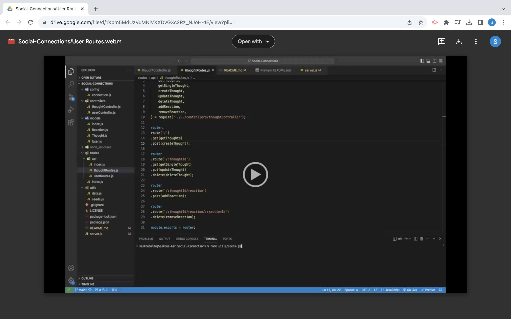
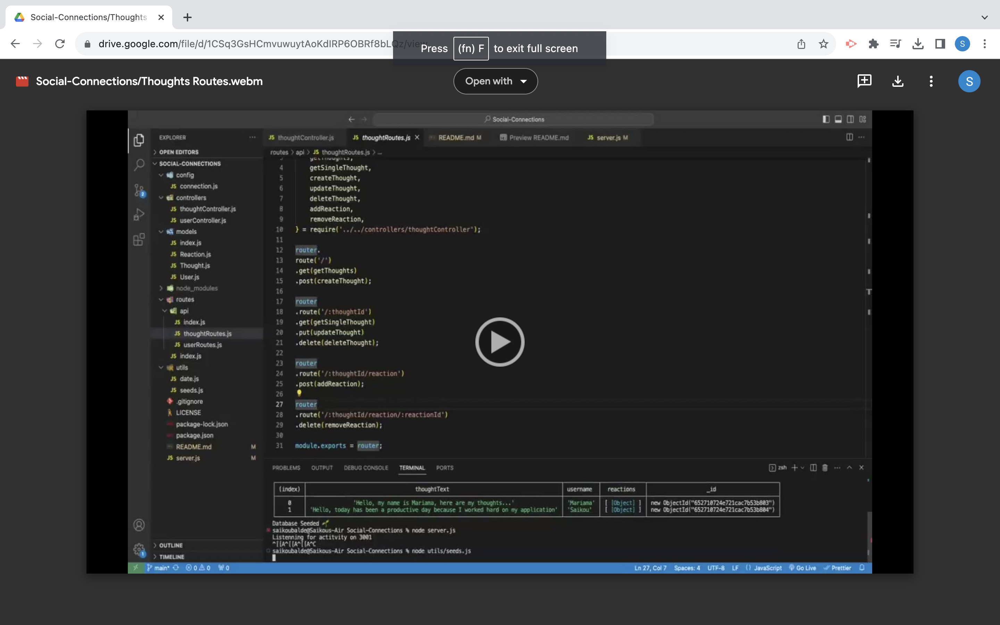
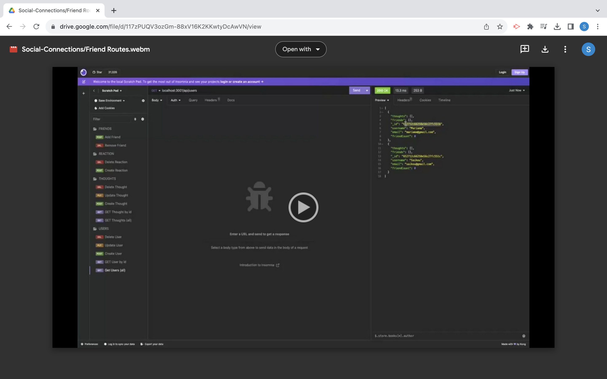
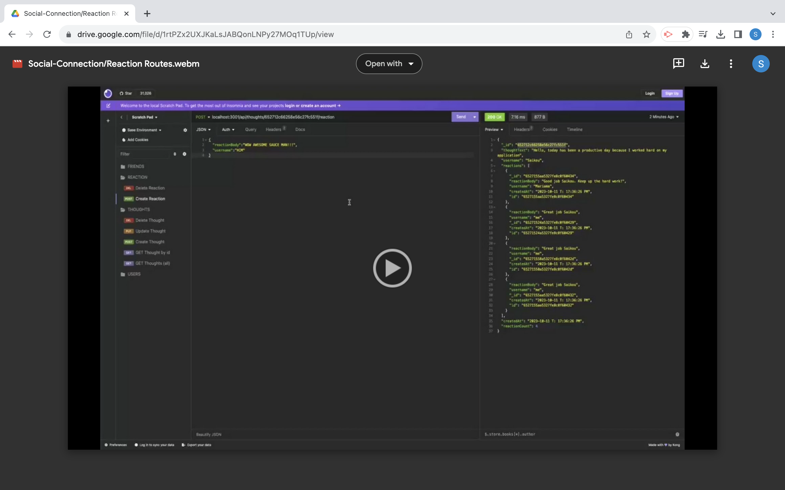

# Social-Connections
  

An API for a social network web application where users can share their thoughts, react to friends’ thoughts, and create a friend list.

## Table of Contents
  
  - [Description](#description)
  - [Walkthrough Videos](#walkthrough-videos)
  - [Technologies](#technologies)
  - [Installation](#installation)
  - [Usage](#usage)
  - [Tests](#testing)
  - [Questions](#questions)
  - [License](#license)

## Description

Social-Connections is a backend `node.js` server side application. This backend application allows user to create a username using an email and username. the user can post their thoughts, react to thoughts and add/remove friends from a friendlist. The application uses `express.js` for routing, `MongoDB` as the database, `Mongoose ODM`, as well as `dayjs` to format the date and time for thoughts and reactions. `Insomnia` is used to test API routes for `GET`, `POST`, `PUT`, and `DELETE`.

## Walkthrough Videos

<table>
  <tbody>
    <tr>
      <td align="center" align="top" width="12%">
        <a href="https://drive.google.com/file/d/1Xpm5MdUzVuMNiVXXDvGXc2Rz_NJoH-1E/preview">
          
        User Routes
        </a>
      </td>
      <td align="center" align="top" width="12%">
        <a href="https://drive.google.com/file/d/1CSq3GsHCmvuwuytAoKdIRP6OBRf8bLQz/view">
          
        Thought Routes
        </a>
      </td>
      <td align="center" align="top" width="12%">
        <a href="https://drive.google.com/file/d/117zPUQV3ozGm-88xV16K2KKwtyDcAwVN/view">
          
        Friend Routes
        </a>
      </td>
      <td align="center" align="top" width="12%">
        <a href="https://drive.google.com/file/d/1rtPZx2UXJKaLsJABQonLNPy27MOq1TUp/view">
          
        Reaction Routes
        </a>
      </td>            
    </tr>
  </tbody>
</table>

## Technologies

&nbsp;&nbsp;

&nbsp;&nbsp;

&nbsp;&nbsp;

&nbsp;&nbsp;

## Installation
To install, download:

&nbsp;&nbsp;

&nbsp;&nbsp;

## Usage

To use application on your local computer, please install the necessary software mentioned in the instalation section of this README.

- Clone this repository to yor local computer via Terminal or GitBash
- Open repository in VS Code through command line Terminal or GitBash by typing `code .`
- Open integrated terminal and install dependencies by typing npm install
- Run the seeds by typing `node utils/seeds.js`
- Finally, run npm start or node server.js
- This app will be listenning for activity via their web browser at default port 3001. Go to http://localhost:3001
- In the Testing section below, there are instructions on how to test the application using insomnia.

## Testing

Insomnia is used to test API calls using a specific port. The port used in this application as previously states is `3001`.

Feel free to take a look at the walkthrough videos provided in the walkthrough section of this README to see how API calls are made through Insomnia.

For further testing directions, here are API routes used for all routes including user, thought, and reactions:

- USER ROUTES

  * `GET` all users `/api/users`
  * a single user by its `_id` and populated thought and friend data: `GET /api/users/:userId` 
  * a new user: `POST /api/users`
  * Delete a user by `id`: `DELETE /api/user/:userId`

- THOUGHT ROUTES

  * Create a thought: POST `/api/thoughts/`
  * Get Thoughts: GET `/api/thoughts/`
  * Get a Thought: GET `/api/thoughts/:thoughtId`
  * Update Thought: PUT `/api/thoughts/:thoughtId`
  * Delete a thought: DELETE `/api/thoughts/:thoughtId`

- FRIEND ROUTES

  * Add a friend to users friend list: POST `/api/users/:userid/friends/:friendId`
  * Remove a friend from a users friend list: DELETE `/api/users/:userid/friends/:friendId`

- REACTION ROUTES

  * Create a reaction: POST `/api/thoughts/:thoughtId/reactions`
  * Delete a reaction: DELETE `/api/thoughts/:thoughtId/reactions/:reactionId`

### Questions
Feel free to check out more of my work on [GitHub](https://github.com/SaikouB)  
[Contact me](bsaikou1990@gmail.com) with any questions about this project.

### LICENSE

[MIT](LICENSE) 

